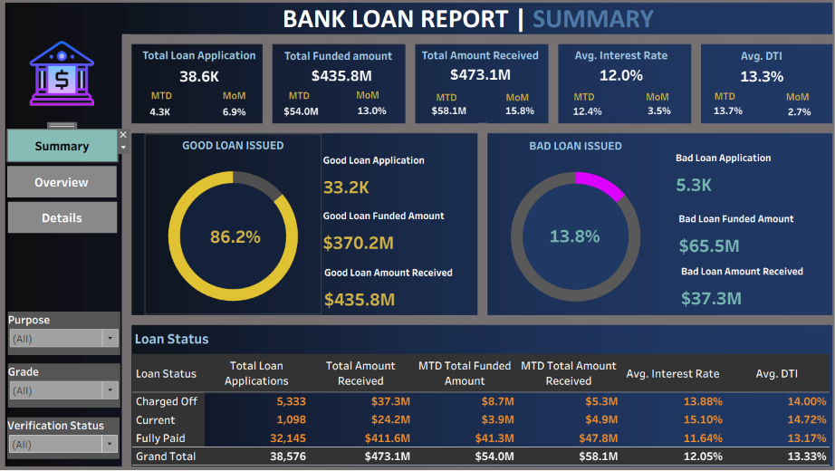
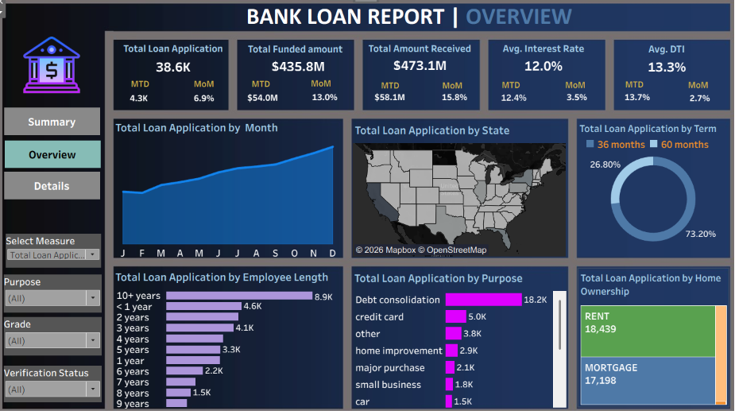
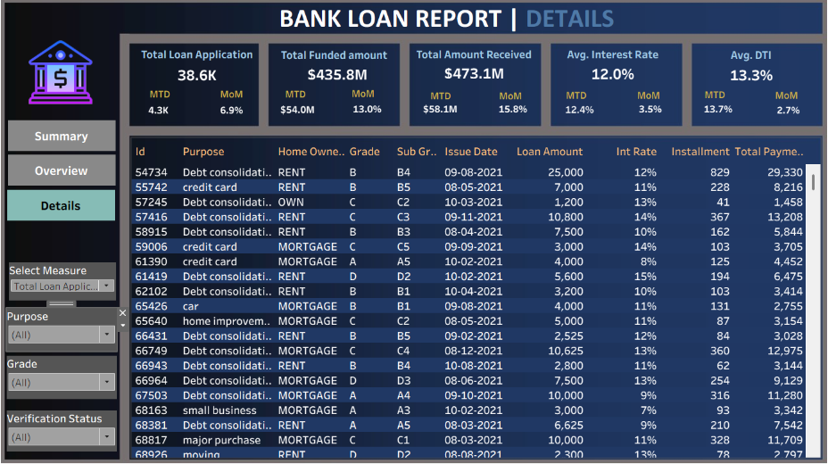

# BANK-LOAN-REPORT
This project analyzes a bank loan dataset containing 38,576 loan applications to identify lending performance, loan quality, and borrower trends. Using SQL for data analysis and Tableau for visualization, the project provides actionable insights into loan approval patterns, repayment performance, and financial risk.

## Dashboard Preview

### Executive Summary

### Loan Overview

### Loan Details

